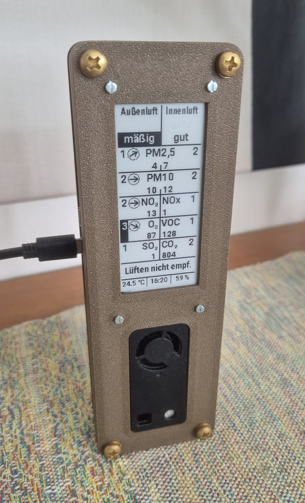

# E-Paper-Anzeige zur vergleichenden Analyse der Luftqualität im Innen- und Außenbereich mittels lokaler Sensorik und offener Umweltdaten

Tobias Zurawski, Hochschule Anhalt, 2026



## Link zu detaillierter Dokumentation und CAD Dateien

XXX

## Verwendete Hardware

- Raspberry Pi Zero W
- Sensirion SEN66
- Waveshare 2.9" ePaper V2
- Micro SD-Karte, mindestens 4 GB Speicher
- Gehäuse und Verschraubung

### Pinout

Sensirion SEN66 an I2C1

| Pin | Name | Pi-Pin | Belegung |
|-----|------|--------|----------|
| 1 | VDD | | 3,3 V |
| 2 | GND | | GND |
| 3 | SDA | 3 | GPIO 2 – I2C1 SDA |
| 4 | SCL | 5 | GPIO 3 – I2C1 SCL |
| 5 | GND | – | nicht belegt (intern mit Pin 2 verbunden) |
| 6 | VDD | – | nicht belegt (intern mit Pin 1 verbunden) |

Waveshare 2,9" ePaper an SPI0

| Pin | Name | Pi-Pin | Belegung |
|-----|------|--------|----------|
| 1 | VCC | | 3,3 V |
| 2 | GND | | GND |
| 3 | DIN | 19 | GPIO 10 – SPI0 MOSI |
| 4 | CLK | 23 | GPIO 11 – SPI0 SCLK |
| 5 | CS | 24 | GPIO 8 – SPI0 CE0 |
| 6 | DC | 22 | GPIO 25 |
| 7 | RST | 11 | GPIO 17 |
| 8 | BUSY | 18 | GPIO 24 |

## Einrichtung des Systems
### Aufsetzen des Pi Zero W über Pi Imager auf micro SD Karte

- Raspberry Pi OS Lite Bookworm 32 Bit
- Benutzername `pi`
- Hostname und Passwort frei wählen
- SSH aktivieren
- WLAN konfigurieren

### Schnittstellen aktivieren und I2C testen

```bash
sudo raspi-config nonint do_spi 0 	# SPI aktivieren
sudo raspi-config nonint do_i2c 0 	# I2C aktivieren
ls /dev/i2c-* /dev/spidev*          # erwartet: /dev/i2c-1 /dev/spidev0.0 /dev/spidev0.1
```

### Update und Installieren der Standard-Bibliotheken

```bash
sudo apt update && sudo apt full-upgrade -y
sudo apt install -y git i2c-tools python3-venv python3-pip python3-pil python3-numpy \
python3-spidev python3-lgpio python3-gpiozero python3-requests libgeos-c1v5

i2cdetect -y 1  # erwartete SEN66-Adresse: 6b
```

### Github Repository klonen

```bash
git clone https://github.com/zuraffl/Luftqualitaet.git ~/Luftqualitaet
```

### 	Pip Pakete in virtual environment installieren (hinterlegt in pip_packages.txt)

```bash
python3 -m venv --system-site-packages ~/airdata-venv
source ~/airdata-venv/bin/activate
pip install -r ~/Luftqualitaet/pip_packages.txt
```

### config.py auf persönliche Einstellungen anpassen

```bash
sudo nano ~/Luftqualitaet/config.py
```
Erläuterungen zu den Parametern stehen in der Datei. Besonders relevant ist die Auswahl geeigneter Referenzstationen des Umweltbundesamtes: `STATION`, `STATION_O3`, `STATION_SO2`. Änderungen der anderen Parameter sind optional.

### Energiesparende Maßnahmen, Neustart erforderlich

```bash
sudo nano /boot/firmware/config.txt
```

```
# Empfohlen: Zeile auskommentieren, deaktiviert GPU-Treiber mit HDMI-Schnittstelle
#dtoverlay=vc4-kms-v3d

# Optional: Zeilen einfügen, deaktiviert Geräte-LED
dtparam=act_led_trigger=none
dtparam=act_led_activelow=on
```

### systemd auf Projektordner verlinken und Dashboard starten

```bash
sudo systemctl link /home/pi/Luftqualitaet/systemd/Dashboard.service
sudo systemctl link /home/pi/Luftqualitaet/systemd/Fetcher_SEN66.service
sudo systemctl link /home/pi/Luftqualitaet/systemd/Fetcher_UBA.service
sudo systemctl daemon-reload
sudo systemctl enable --now Dashboard.service Fetcher_SEN66.service Fetcher_UBA.service
```

## Laufender Betrieb

Planmäßig sind im laufenden Betrieb keine Eingriffe nötig.

Die gemessene Leistungsaufnahme beträgt 0,7 W. 

Das Herunterfahren des Dashboards sollte über die Kommandozeile erfolgen, da das Display sonst einfriert.

```bash
sudo shutdown -h now
```

Ist dies nicht möglich, besteht bei Stromanschluss ein Zeitfenster, um das bereinigte Display zu trennen.

Log-Verzeichnis:
```bash
cd ~/Luftqualitaet/Logging_Files
```

Log-Dateien der drei Hauptskripte archivieren sich ab 1 MB Dateigröße selbst und werden rotierend gelöscht.

CSV-Logging ist in `config.py` deaktivierbar und legt monatlich eine neue Datei an; ohne selbstständige Löschung.

## Lizenz

Dieses Projekt steht unter der GNU General Public License v3.0, siehe [LICENSE](LICENSE).

## Bestandteile Dritter

- Font: Roboto von Google, Apache License 2.0
- Display-Treiber: Waveshare, MIT-Lizenz
- API-Daten: Umweltbundesamt mit Daten der Messnetze der Länder und des Bundes